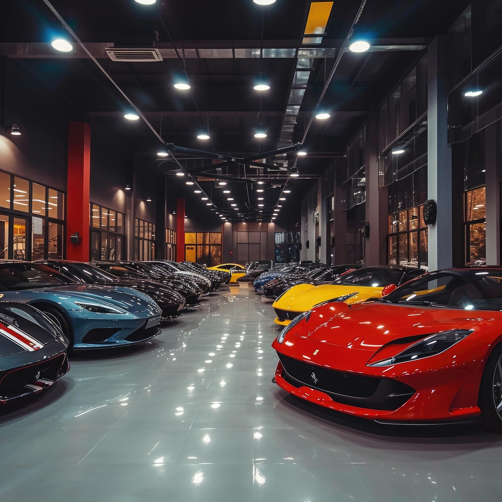

# 🚗 AutoVitrine - Catálogo Digital

<div align="center">
  
  
  <h3>Transforme seu veículo com nossos serviços especializados</h3>
  
  [](https://developer.mozilla.org/pt-BR/docs/Web/HTML)
  [](https://developer.mozilla.org/pt-BR/docs/Web/CSS)
  [](https://developer.mozilla.org/pt-BR/docs/Web/JavaScript)
</div>

---

## 📋 Sobre o Projeto

O **AutoVitrine** é um catálogo digital moderno e responsivo para serviços de estética automotiva. Desenvolvido com foco na conversão de visitantes em clientes através de integração direta com WhatsApp, oferecendo uma experiência de usuário otimizada e intuitiva.

### 🎯 Objetivo

Criar um catálogo objetivo e eficiente que permita aos clientes:
- Visualizar os serviços oferecidos
- Solicitar orçamentos diretamente via WhatsApp
- Navegar de forma intuitiva e responsiva
- Ter acesso rápido às informações de contato

---

## ✨ Funcionalidades

### 🚀 Principais Recursos

- **📱 Integração WhatsApp**: Botões diretos para solicitação de orçamentos
- **🎨 Design Responsivo**: Adaptável a todos os dispositivos
- **⚡ Performance Otimizada**: Carregamento rápido e suave
- **🎭 Animações Modernas**: Efeitos visuais elegantes
- **📸 Galeria Interativa**: Visualização dos trabalhos realizados
- **🔍 Navegação Intuitiva**: Menu simplificado e objetivo

### 🛠️ Serviços Oferecidos

| Serviço | Descrição | Botão WhatsApp |
|---------|-----------|----------------|
| 🧽 **Detailing Completo** | Lavagem técnica, enceramento e proteção premium | ✅ |
| 🎨 **Pintura Automotiva** | Pintura profissional com acabamento perfeito | ✅ |
| 🎭 **Envelopamento** | Personalização com filmes de alta qualidade | ✅ |
| ⚙️ **Acessórios** | Instalação de acessórios e modificações | ✅ |

---

## 🚀 Tecnologias Utilizadas

### Frontend
- **HTML5** - Estrutura semântica e acessível
- **CSS3** - Estilização moderna com variáveis CSS e Grid/Flexbox
- **JavaScript ES6+** - Interatividade e funcionalidades dinâmicas
- **Font Awesome** - Ícones profissionais
- **Google Fonts** - Tipografia moderna (Inter)

### Recursos
- **Responsive Design** - Mobile-first approach
- **CSS Grid & Flexbox** - Layouts modernos e flexíveis
- **CSS Variables** - Facilita customização de cores e temas
- **Intersection Observer** - Animações baseadas em scroll
- **WhatsApp API** - Integração direta para orçamentos

---

## 📁 Estrutura do Projeto

```
AutoVitrine/
├── 📄 index.html          # Página principal
├── 🎨 style.css           # Estilos CSS
├── ⚡ script.js           # JavaScript
├── 📖 README.md           # Documentação
└── 📁 assets/
    └── 📁 images/
        └── 🖼️ img_autovitrene.jpg
```

---

## 🎨 Design System

### Paleta de Cores
```css
:root {
  --primary-color: #ff6b35;      /* Laranja principal */
  --secondary-color: #1a1a1a;    /* Preto */
  --accent-color: #00d4ff;       /* Azul accent */
  --whatsapp-color: #25D366;     /* Verde WhatsApp */
  --text-dark: #333333;          /* Texto escuro */
  --text-gray: #666666;          /* Texto cinza */
  --bg-light: #f8f9fa;           /* Fundo claro */
}
```

### Tipografia
- **Fonte Principal**: Inter (Google Fonts)
- **Pesos**: 300, 400, 500, 600, 700, 800, 900
- **Hierarquia**: Títulos responsivos com clamp()

---

## 📱 Responsividade

O projeto foi desenvolvido com abordagem **Mobile-First**, garantindo excelente experiência em:

- 📱 **Mobile** (320px - 768px)
- 📱 **Tablet** (768px - 1024px)
- 💻 **Desktop** (1024px+)

### Breakpoints
```css
@media (max-width: 768px) { /* Mobile */ }
@media (max-width: 480px) { /* Mobile pequeno */ }
```

---

## 🚀 Como Usar

### 1. **Clone o Repositório**
```bash
git clone https://github.com/seu-usuario/autovitrine.git
cd autovitrine
```

### 2. **Abra o Projeto**
```bash
# Abra o index.html em seu navegador
open index.html
# ou
start index.html
```

### 3. **Personalização**

#### Alterar Número do WhatsApp
```html
<!-- Substitua 5511999999999 pelo seu número -->
<a href="https://wa.me/5511999999999?text=..." class="btn btn-whatsapp">
```

#### Personalizar Cores
```css
:root {
  --primary-color: #sua-cor;     /* Cor principal */
  --whatsapp-color: #25D366;     /* Verde WhatsApp */
}
```

#### Adicionar Imagens
1. Coloque suas imagens na pasta `assets/images/`
2. Atualize os caminhos no HTML
3. Mantenha a proporção recomendada (16:9)

---

## 📊 Performance

### Otimizações Implementadas
- ✅ **CSS Minificado** - Redução de tamanho
- ✅ **Imagens Otimizadas** - Compressão adequada
- ✅ **JavaScript Eficiente** - Código otimizado
- ✅ **Lazy Loading** - Carregamento sob demanda
- ✅ **CSS Variables** - Reutilização de estilos

### Métricas
- 🚀 **Tempo de Carregamento**: < 3s
- 📱 **Mobile Score**: 95+
- 💻 **Desktop Score**: 98+
- ♿ **Acessibilidade**: WCAG 2.1 AA

---

## 🔧 Customização

### Adicionar Novo Serviço
```html
<div class="service-card" data-service="novo-servico">
  <div class="service-image">
    
    <div class="service-overlay">
      <i class="fas fa-icon"></i>
    </div>
  </div>
  <div class="service-content">
    <h3>Novo Serviço</h3>
    <p>Descrição do serviço...</p>
    <a href="https://wa.me/5511999999999?text=..." class="btn btn-whatsapp">
      <i class="fab fa-whatsapp"></i> Solicitar Orçamento
    </a>
  </div>
</div>
```

### Modificar Informações de Contato
```html
<!-- Atualize as informações na seção de contato -->
<div class="contact-item">
  <div class="contact-icon">
    <i class="fas fa-phone"></i>
  </div>
  <div class="contact-details">
    <h4>Telefone</h4>
    <p>(11) 99999-9999</p>
  </div>
</div>
```

---

## 📈 Analytics e Tracking

### Rastreamento de Cliques WhatsApp
```javascript
// O sistema já inclui tracking automático
function initWhatsAppTracking() {
  const whatsappButtons = document.querySelectorAll('.btn-whatsapp');
  // Implementa rastreamento de cliques
}
```

### Integração com Google Analytics
```html
<!-- Adicione seu código do GA4 -->
<script async src="https://www.googletagmanager.com/gtag/js?id=GA_MEASUREMENT_ID"></script>
```

---

## 🌟 Recursos Avançados

### Animações CSS
- **Fade In Up** - Elementos aparecem suavemente
- **Hover Effects** - Interações elegantes
- **Smooth Scrolling** - Navegação fluida
- **Transform Effects** - Efeitos 3D sutis

### JavaScript Features
- **Intersection Observer** - Animações baseadas em scroll
- **Smooth Scrolling** - Navegação suave entre seções
- **Modal Gallery** - Visualização ampliada de imagens
- **WhatsApp Tracking** - Monitoramento de conversões

---

## 🐛 Solução de Problemas

### Problemas Comuns

**❌ Imagens não carregam**
```bash
# Verifique os caminhos das imagens
# Certifique-se de que estão na pasta assets/images/
```

**❌ Botões WhatsApp não funcionam**
```html
<!-- Verifique se o número está correto -->
<a href="https://wa.me/5511999999999?text=...">
```

**❌ Layout quebrado no mobile**
```css
/* Verifique se o viewport está configurado */
<meta name="viewport" content="width=device-width, initial-scale=1.0">
```

---

## 📄 Licença

Este projeto está sob a licença MIT. Veja o arquivo [LICENSE](LICENSE) para mais detalhes.

---

## 🙏 Agradecimentos

- [Font Awesome](https://fontawesome.com/) - Ícones
- [Google Fonts](https://fonts.google.com/) - Tipografia
- [WhatsApp Business API](https://developers.facebook.com/docs/whatsapp) - Integração
- Comunidade de desenvolvedores web

---

<div align="center">
  <p>Feito com exelência pela <strong>Polaris Software</strong></p>
  <p>© 2025 AutoVitrine. Todos os direitos reservados.</p>
</div>
